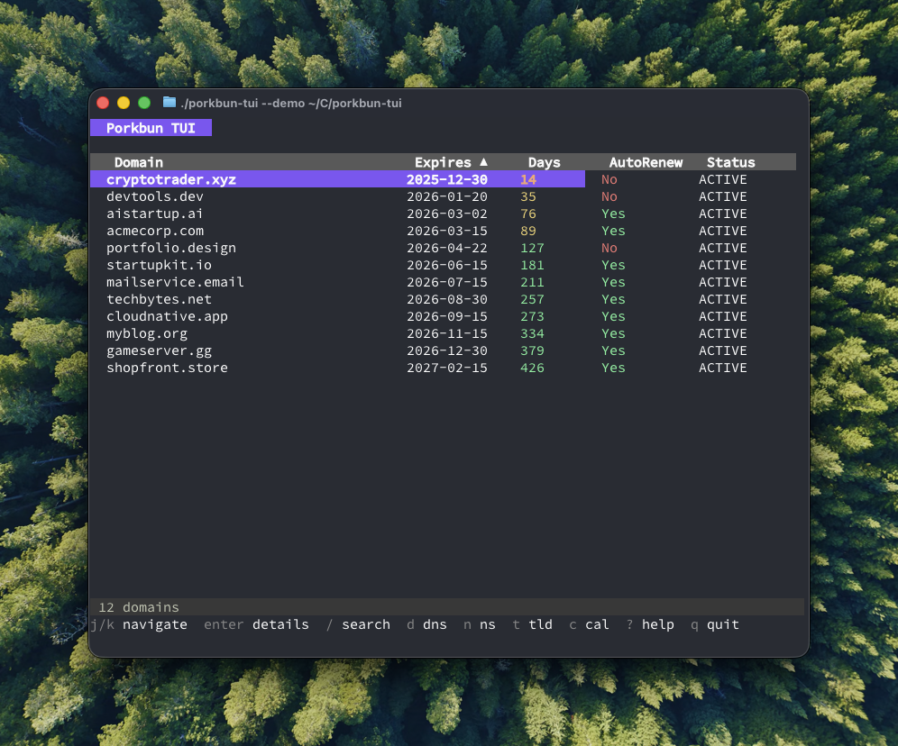
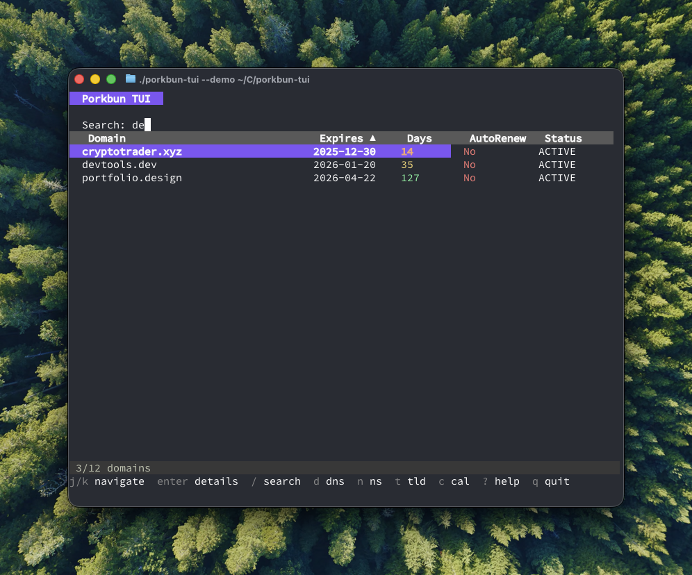
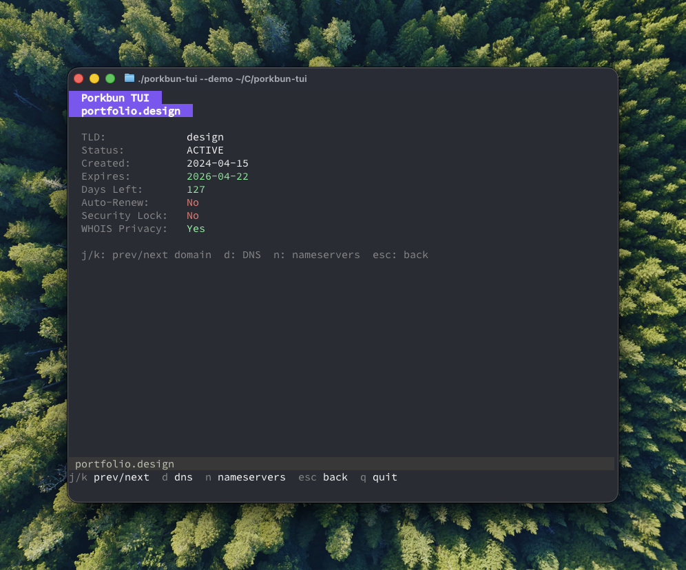
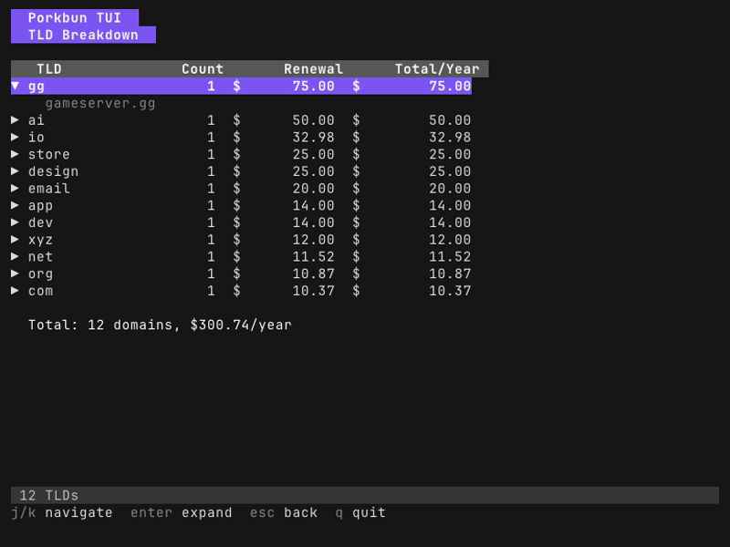
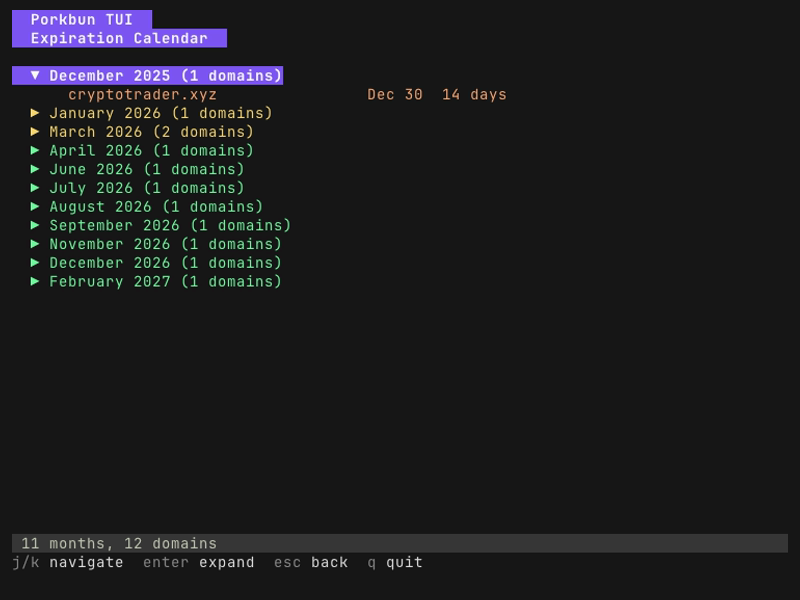

# porkbun-tui

A terminal UI for managing your [Porkbun](https://porkbun.com) domains.




<details>
<summary>More screenshots</summary>

### Search


### Domain Details


### TLD Breakdown


### Calendar View


</details>

## Features

- **Domain List** - View all your domains with search, filter, and sort
- **Domain Details** - Expiration, auto-renew status, WHOIS privacy, security lock
- **DNS Records** - View DNS records for any domain
- **Nameservers** - View and edit nameservers with presets (Cloudflare, Google, etc.)
- **TLD Breakdown** - See domains grouped by TLD with renewal costs
- **Calendar View** - See domains grouped by expiration month
- **Domain Availability** - Check if a domain is available for registration
- **Offline-First** - Cached data loads instantly, refreshes in background

## Installation

### From Source

```bash
git clone https://github.com/bc/porkbun-tui.git
cd porkbun-tui
go build -o porkbun-tui ./cmd/porkbun-tui
```

Or with [just](https://github.com/casey/just):

```bash
just build
```

## Configuration

Get your API keys from [porkbun.com/account/api](https://porkbun.com/account/api).

### Environment Variables (recommended)

```bash
export PORKBUN_API_KEY=pk1_xxx
export PORKBUN_SECRET_KEY=sk1_xxx
```

### Config File

Create `~/.config/porkbun-tui/config.yaml`:

```yaml
api_key: pk1_xxx
secret_key: sk1_xxx
```

## Usage

```bash
./porkbun-tui
```

### Keyboard Shortcuts

| Key | Action |
|-----|--------|
| `j` / `k` / `↑` / `↓` | Navigate |
| `Enter` | Select / expand |
| `Esc` | Go back |
| `/` | Search / filter domains |
| `d` | View DNS records |
| `n` | View / edit nameservers |
| `t` | TLD breakdown (costs) |
| `c` | Calendar view (expirations) |
| `a` | Check domain availability |
| `r` | Refresh data |
| `1` | Sort by name |
| `2` | Sort by expiration |
| `?` | Show help |
| `q` | Quit |

### Command Line

```
porkbun-tui [options]

Options:
  -h, --help      Show help
  -v, --version   Show version
```

## Cache

Data is cached in `~/.cache/porkbun-tui/` for instant startup. The app fetches fresh data in the background and updates automatically.

## Development

```bash
# Build
just build

# Run tests
just test

# Run tests with coverage
just test-coverage

# Format code
just fmt

# Build for all platforms
just build-all
```

## License

MIT
